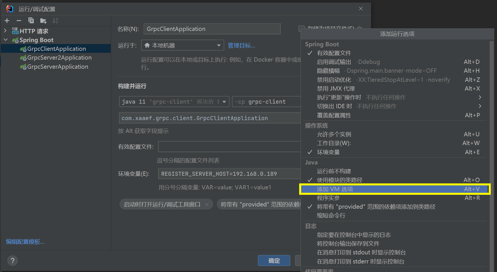
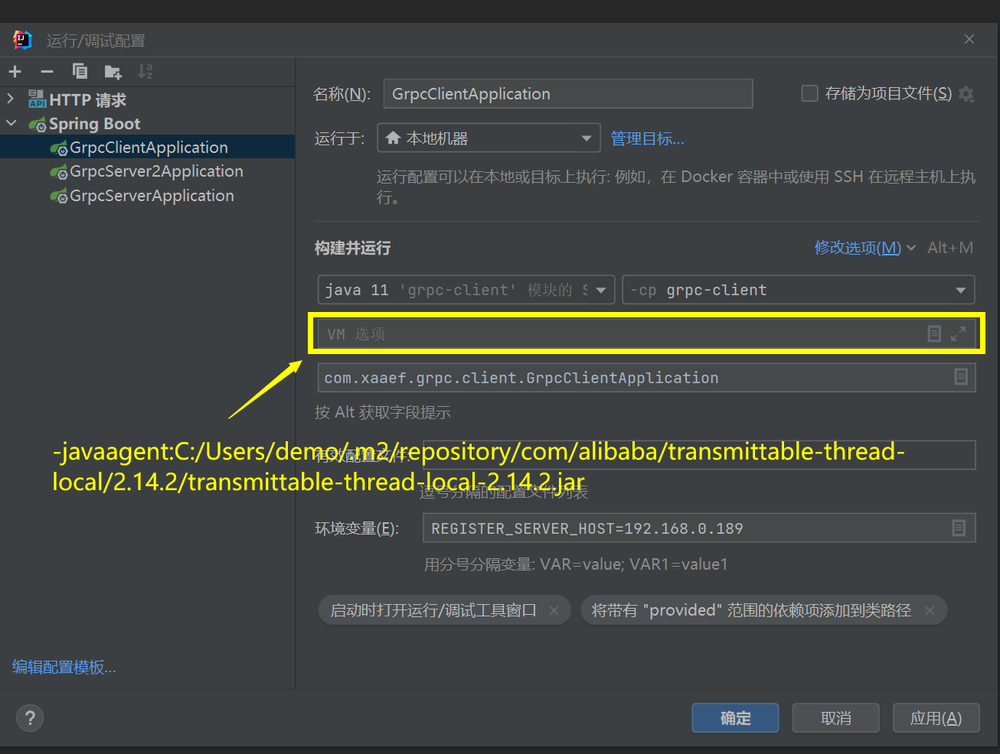

# spring cloud grpc demo

### 启动注意事项





```

每一个grpc 客户端 和 服务端 都要在 添加启动参数

-javaagent:${maven_repository}/com/alibaba/transmittable-thread-local/2.14.2/transmittable-thread-local-2.14.2.jar

-javaagent:C:/Users/demo/.m2/repository/com/alibaba/transmittable-thread-local/2.14.2/transmittable-thread-local-2.14.2.jar


```
